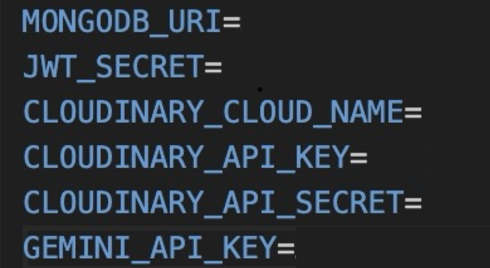

# What's New

## Table of Contents
- [Project Overview](#project-overview)
- [Features of the software](#features-of-the-software)
- [Installation Instructions](#installation-instructions)
- [Usage Guide](#usage-guide)
- [Contributors](#contributors)

---

## Project Overview
- This project aims to create a dynamic community-based newsletter platform that allows users to share and explore events happening around them in real time. By leveraging user-generated posts, modern data storage solutions, and generative AI, the platform curates the most relevant and engaging content into a daily newsletter. The newsletter provides concise summaries of the day's top events, enhancing community awareness and interaction.

---

## Features of the software
**1. User-Generated News Report**
- Anonymously read & share community news in real time: Users will only be able to see/post news in the area they are currently located in.
**2. User engagement & Interaction**
- Receive/give upvote & downvote for posts
- Maintain streaks by posting everyday
- Be able to see a global history of total likes across all posts on user profile
**3. News Digest Generation**
- Subscribe to receive daily news digests from areas of your choice
- Digest includes the most popular or important news from the community summarized through our trained AI model

---

## Installation Instructions
1. Open the program in an IDE of your choice
2. Run npm install on both frontend and backend
4. Create a .env file and store it in the backend folder
5. Fill in the required information using the following naming conventions:

     
   
    - Sign in and create your [Gemini API Key](https://aistudio.google.com/welcome)
    - Create the database [MongoDB](https://www.mongodb.com/cloud)
    - Get Cloud name, API key, API secret [Cloudinary](https://cloudinary.com)
6. Run the program on localhost5173
=======
main

---

## Usage Guide

1. **Launch the Program**

2. **Enter Details**:
    - Sign up and authorize for an account

3. **Begin Using the Program!**
    - Posting *Posting are only allowed after 7 days of registration
    - Upvoting/downvoting
    - Subscribe to daily digests in any area

---

## Contributors
- **Kunal Rishi**: [GitHub](https://github.com/plumedeneko)
- **Anthony Kim**: [GitHub](https://github.com/antmskim)
- **Richard Lin**: [GitHub](https://github.com/richardrLin)
- **Mina Wu**: [GitHub](https://github.com/MW0808)

---

